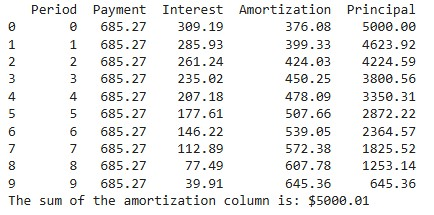
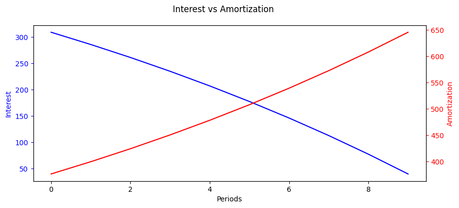

# 📊 Loan Amortization Table Generator
A simple Python module to generate amortization tables for fixed-rate loans. This tool calculates periodic payments,
interest, principal amortization, and remaining balance over the life of a loan.

## 🔧 Features
- Calculates equivalent periodic interest rate from annual rate
- Computes fixed payment per period (monthly, quarterly, etc.)
- Generates a detailed amortization schedule using pandas
- Supports payments at the beginning or end of each period

## 📦 Requirements
- `Python 3.11+`
- `pandas`
- `numpy`
- `matplotlib`

## 🧪 Example and Visualization
The `test.py` script demonstrates how to use the `LoanAmortization` class with a sample loan and includes a visualization of interest vs. amortization over time.

### 🚀 Usage
```python
from amortization_table import LoanAmortization

loan = LoanAmortization(
    loan_amount=5000,
    annual_rate=0.1275,
    periods_per_year=2,
    years=5
)

# Get the table
table = loan.get_table()
print(table)

# Current amortization
amort_total = table['Amortization'].sum()
print(f"The sum of the amortization column is: ${amort_total:.2f}")
```

### 📈 Visualization
The script plots interest vs. amortization across all periods using `Matplotlib`. The source code is in the `test.py` file.
- Blue line: Interest per period
- Red line: Principal amortization per period
- Dual-axis plot for clear comparison
- This helps users visually understand how interest declines and principal repayment accelerates over time.

<p align="center">
  
</p>

<p align="center">
  
</p>


## 🧠 Behind the Scenes
The class uses the formula for fixed-rate loan payments and iteratively computes interest and principal breakdowns for
each period. It supports both end-of-period and beginning-of-period payments.

---

## 🛠️ Optional Enhancements
The checklist will be updated as soon as the feature is incorporated.
- [ ] Add CLI interface for user input
- [ ] Export amortization table to CSV or Excel
- [ ] Add unit tests for edge cases (e.g., zero interest, single period)
